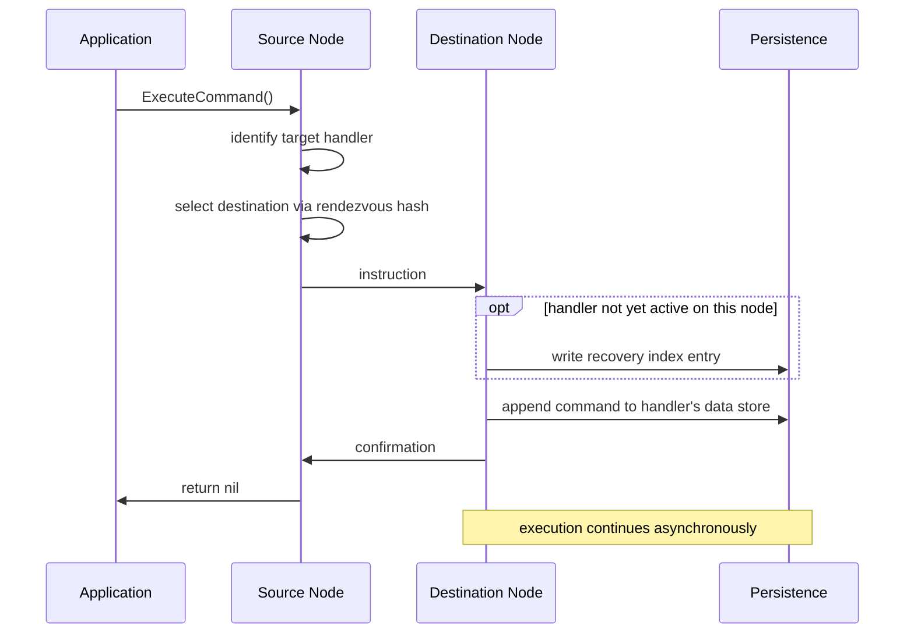

# 6. Durable command executor

Date: 2026-04-08

## Status

Accepted

- References [2. Rendezvous hashing for workload assignment][ADR-2]
- References [4. Ranked instruction routing][ADR-4]
- References [5. Homogeneous cluster nodes][ADR-5]
- Amended by [9. Handler-keyed aggregate routing][ADR-9]

## Context

The Dogma API requires [`CommandExecutor.ExecuteCommand()`] return `nil` only
after the engine has committed to executing the command, regardless of what
happens next. That commitment must survive crashes: if the process dies
immediately after returning `nil`, the command must execute when the node
restarts.

Loading handler state, passing the command to the handler, persisting events,
and any other execution steps happen asynchronously after `ExecuteCommand()`
returns. The [`WithEventObserver`] option affects exactly when it returns, but
does not change the fundamentals of the commitment.

To honor that commitment, the command must reach durable storage before
`ExecuteCommand()` returns. The question is where it should be written and what
state the engine needs to maintain alongside it to support efficient recovery
after a crash.

## Decision

We will write the command directly to a handler-specific data store, chosen
based on the application's routing configuration. That write is the engine's
durability commitment. Once it succeeds, `ExecuteCommand()` returns `nil`.

### Handler-specific data stores

Each aggregate instance and each integration handler has its own data store. Its
identity determines the granularity of optimistic concurrency control (OCC)
contention and recovery scope. It must be stable across changes to the
application's routing configuration, so that a command accepted under one
configuration is still findable and executable under another.

For aggregates, the data store is identified by `(app_key, handler_key, instance_id)`.
Multiple commands may target the same instance; all share the same data store,
which tracks the instance's full lifecycle.

For integrations, the data store is identified by `(node, app_key, handler_key)`.
Each node maintains its own state for each integration handler.

The internal structure of each handler type's data store is outside the scope of
this ADR.

### Accepting a command

When `ExecuteCommand()` is called, the following steps complete before it
returns:

1. Identify the target handler based on the application's routing configuration.
   For aggregates, call [`AggregateMessageHandler.RouteCommandToInstance()`] to
   obtain the instance ID.
2. Determine which cluster node should handle the command.
3. Send an [instruction] to the destination node to execute the command.

**On the destination node:**

4. If the aggregate instance or handler is not already loaded, durably write a
   [recovery index] entry to record that this node has work in progress for it.
5. Add the command to the handler's data store as pending work.
6. Send a [confirmation] to the source node, completing the `ExecuteCommand()`
   call.



### Handler node selection

#### Aggregate handlers

For aggregates, every command targets a specific instance. Any node can
independently apply [rendezvous hashing][ADR-2] to select the same destination
node, hashing the instance ID:

```
routing_key = uuid5(app_key, instance_id)
destination = rendezvous_hash(routing_key, available_nodes)
```

> [!NOTE]
> The handler key is intentionally absent from the inputs to the hash. This
> decision was later reversed by [ADR-9].

#### Integration handlers

For integrations, the handler has no instance dimension, but it may declare a
concurrency preference via [`IntegrationConfigurer.ConcurrencyPreference()`].

There are three potential configurations:

- **No preference declared:** the handler does not call
  `ConcurrencyPreference()`. The engine performs no routing of its own;
  distribution is left to the infrastructure (such as a load balancer). Whatever
  node `ExecuteCommand()` is called on handles the command locally.
- **[`MinimizeConcurrency`]:** all commands for the handler are funneled to a
  single node:

  ```
  routing_key = uuid5(app_key, handler_key)
  destination = rendezvous_hash(routing_key, available_nodes)
  ```

- **[`MaximizeConcurrency`]:** commands are spread across nodes to maximize
  throughput:

  ```
  routing_key = command_uuid
  destination = rendezvous_hash(routing_key, available_nodes)
  ```

In all cases, the command is delivered using [ranked instruction routing][ADR-4].

### Recovery index

We will maintain a per-node index that records which aggregate instances and
integration handlers currently have work in progress on that node. Each entry
in the index identifies a specific aggregate instance or integration handler:

- Aggregates: `(node, app_key, handler_key, instance_id)`
- Integrations: `(node, app_key, handler_key)`

For aggregates, the recovery index key adds a `node` dimension that the data
store key does not have. The data store is identified independently of any node;
the recovery index partitions entries by node to track where work is happening.

Each entry in the index tracks one aggregate instance or integration handler for
as long as pending work exists. An entry is written when the handler first
becomes active on the node and removed when it is no longer active — not per
command.

Index entries must be durably written _before_ the write to the handler's data
store. If a crash occurs between the two, the restarting node sees an index
entry with no corresponding pending command in the data store, which is safe to
clean up. The reverse order would leave a command in the data store with no
index entry pointing to it.

### Recovery procedure

On startup, each node iterates its own recovery index. For each entry:

1. Scan the handler's data store for commands that have not yet been completed.
2. Validate each pending command's routing against the current application
   configuration. Any change to application configuration requires a new binary,
   which requires a restart — so re-validating on every startup is sufficient.
   There is no window in which a command can execute under a stale configuration.
   - If routing is unchanged: execute it.
   - If routing has changed: [reroute] it.
   - If the command is unroutable: [quarantine] it.
3. If no pending commands remain after processing, delete the recovery index
   entry.

A surviving node that takes ownership of a dead node's in-progress work follows
the same steps, iterating the dead node's recovery index entries in place of its
own. We call this process **orphaned workload adoption**. How a surviving node
gains access to a dead node's recovery index is outside the scope of this ADR.

### Rerouting

When a routing change assigns a pending command to a different handler, the
command must move from one handler's data store to another. The persistence
layer does not support atomic operations across data stores ([ADR-5]), so the
transfer requires explicit crash recovery.

The originating node must durably record its intent to reroute a command before
initiating the transfer. If a crash occurs mid-reroute, the restarting node can
detect the in-progress state and resume. The destination must handle a duplicate
delivery idempotently, since the originating node may retry after a crash. The
exact protocol depends on how each handler type's data store is structured and
is outside the scope of this ADR.

Concurrency preference changes do not trigger rerouting. Preferences are not
guarantees; a command executed on a node that is not the rendezvous-preferred
node for that preference is still correct.

### Idempotent command submission

This design makes every command durable at the point `ExecuteCommand()` returns,
regardless of whether [`WithIdempotencyKey()`] was supplied. The idempotent
command submission layer — cluster-wide deduplication, the retry contract, and
recovery from intermediate failures — is a separate concern that sits in front
of this mechanism. The design of that layer is outside the scope of this ADR.

### Dismissed alternatives

**Separate command-tracking store.** Adds a throwaway write and cleanup delete
per command; writing directly to the handler's data store puts the command where
execution will read it, avoiding both.

**Per-command data store for integrations.** Prevents lifecycle-based recovery
index tracking — the index would need one entry per command instead of one per
handler.

**Cluster-wide data store for integrations.** Causes OCC contention when
multiple nodes accept commands for the same handler concurrently.

## Consequences

Writing the command to the handler's data store is both the durability
commitment and the source from which execution reads. A command that reaches the
handler's data store will be executed regardless of subsequent crashes. The
recovery index lets a restarting node find all unfinished work without scanning
every handler's data store in the cluster.

Committing a command when the aggregate instance or integration handler is warm
costs one write: appending to the data store. The recovery index entry is
already present from when it was first loaded. Committing when it is cold costs
two writes: the index entry first, then appending to the data store.

The size of the recovery index is proportional to the number of active aggregate
instances and integration handlers, not the number of pending commands. A busy
aggregate instance with many queued commands produces only one index entry.

Lifecycle tracking and recovery are naturally aligned. The index entry covers
exactly the period during which the handler has pending work, so no separate
bookkeeping is needed.

Routing changes are caught at restart. Every prior routing decision is
re-validated against the current application configuration before the command
executes.

> [!IMPORTANT]
> The behavior described below has been amended by [ADR-9].

Because the aggregate handler routing key is derived from the instance ID — not
the handler key — instances of different types with the same ID will gravitate
to the same node. For example, instances of `Customer` and `CustomerProfile`
aggregates with instance ID `customer-7` will tend to be co-located. This
co-location is intentional, and may apply to process handlers as well. The full
routing strategy across handler types is outside the scope of this ADR.

This ADR introduces three terms to the [glossary]: **recovery index**,
**orphaned workload adoption**, and **rerouting**.

### Quarantine

When a command cannot be routed — because the handler type has been removed from
the application — it must be set aside rather than discarded or retried
indefinitely. The design of the quarantine is outside the scope of this ADR.

<!-- references -->

[ADR-2]: 0002-rendezvous-hashing-for-workload-assignment.md
[ADR-4]: 0004-ranked-instruction-routing.md
[ADR-5]: 0005-homogeneous-cluster-nodes.md
[ADR-7]: 0007-node-heartbeat.md
[ADR-9]: 0009-handler-keyed-aggregate-routing.md
[`AggregateMessageHandler.RouteCommandToInstance()`]: https://pkg.go.dev/github.com/dogmatiq/dogma#AggregateMessageHandler.RouteCommandToInstance
[`CommandExecutor.ExecuteCommand()`]: https://pkg.go.dev/github.com/dogmatiq/dogma#CommandExecutor.ExecuteCommand
[confirmation]: ../glossary.md#confirmation
[glossary]: ../glossary.md
[instruction]: ../glossary.md#instruction
[`IntegrationConfigurer.ConcurrencyPreference()`]: https://pkg.go.dev/github.com/dogmatiq/dogma#IntegrationConfigurer.ConcurrencyPreference
[`MaximizeConcurrency`]: https://pkg.go.dev/github.com/dogmatiq/dogma#MaximizeConcurrency
[`MinimizeConcurrency`]: https://pkg.go.dev/github.com/dogmatiq/dogma#MinimizeConcurrency
[quarantine]: #quarantine
[recovery index]: #recovery-index
[reroute]: #rerouting
[`WithEventObserver`]: https://pkg.go.dev/github.com/dogmatiq/dogma#WithEventObserver
[`WithIdempotencyKey()`]: https://pkg.go.dev/github.com/dogmatiq/dogma#WithIdempotencyKey
