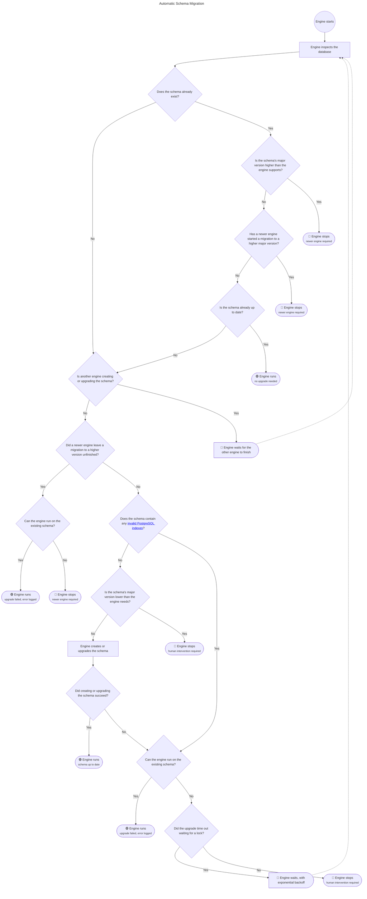

# Automatic schema migration

This flowchart illustrates how the engine checks, and if necessary upgrades, the
database schema each time it starts.

```mermaid
---
title: Automatic Schema Migration
config:
  flowchart:
    curve: basis
  themeCSS: "marker { overflow: visible; } marker path { transform: scale(1.25); transform-origin: 10px 5px; }"
---
flowchart TD
	start@{shape: circle, label: "Engine starts"}

	inspect@{shape: rect, label: "Engine inspects the database"}
	exists@{shape: diamond, label: "Does the schema already exist?"}
	majorAhead@{shape: diamond, label: "Is the schema's major version higher than the engine supports?"}
	migratingMajor@{shape: diamond, label: "Has a newer engine started a migration to a higher major version?"}
	upToDate@{shape: diamond, label: "Is the schema already up to date?"}
	busy@{shape: diamond, label: "Is another engine creating or upgrading the schema?"}
	wait@{shape: delay, label: "🔄 Engine waits for the other engine to finish"}
	migratingAhead@{shape: diamond, label: "Did a newer engine leave a migration to a higher version unfinished?"}
	indexes@{shape: diamond, label: "Does the schema contain any <a href='https://www.postgresql.org/docs/18/sql-createindex.html#SQL-CREATEINDEX-CONCURRENTLY' target='_blank'>invalid PostgreSQL indexes</a>?"}
	majorBehind@{shape: diamond, label: "Is the schema's major version lower than the engine needs?"}
	succeeded@{shape: diamond, label: "Did creating or upgrading the schema succeed?"}
	lockTimeout@{shape: diamond, label: "Did the upgrade time out waiting for a lock?"}
	retry@{shape: delay, label: "🔄 Engine waits, with exponential backoff"}
	runsDespiteMigration@{shape: diamond, label: "Can the engine run on the existing schema?"}
	runsDespiteFailure@{shape: diamond, label: "Can the engine run on the existing schema?"}

	upgrade@{shape: rect, label: "Engine creates or upgrades the schema"}

	runAsIs@{shape: stadium, label: "🟢 Engine runs<br><small>no&nbsp;upgrade&nbsp;needed</small>"}
	runUpgraded@{shape: stadium, label: "🟢 Engine runs<br><small>schema&nbsp;up&nbsp;to&nbsp;date</small>"}
	runWithMigration@{shape: stadium, label: "🟢 Engine runs<br><small>upgrade&nbsp;failed,&nbsp;error&nbsp;logged</small>"}
	runWithFailure@{shape: stadium, label: "🟢 Engine runs<br><small>upgrade&nbsp;failed,&nbsp;error&nbsp;logged</small>"}
	tooNew@{shape: stadium, label: "🛑 Engine stops<br><small>newer&nbsp;engine&nbsp;required</small>"}
	migratingTooNew@{shape: stadium, label: "🛑 Engine stops<br><small>newer&nbsp;engine&nbsp;required</small>"}
	unfinished@{shape: stadium, label: "🛑 Engine stops<br><small>newer&nbsp;engine&nbsp;required</small>"}
	needsOffline@{shape: stadium, label: "🛑 Engine stops<br><small>human&nbsp;intervention&nbsp;required</small>"}
	failed@{shape: stadium, label: "🛑 Engine stops<br><small>human&nbsp;intervention&nbsp;required</small>"}

	start --> inspect
	inspect --> exists
	exists -->|No| busy
	exists -->|Yes| majorAhead
	majorAhead -->|No| migratingMajor
	majorAhead -->|Yes| tooNew
	migratingMajor -->|No| upToDate
	migratingMajor -->|Yes| migratingTooNew
	upToDate -->|No| busy
	upToDate -->|Yes| runAsIs
	busy -->|No| migratingAhead
	busy -->|Yes| wait
	wait -.-> inspect
	migratingAhead -->|Yes| runsDespiteMigration
	migratingAhead -->|No| indexes
	runsDespiteMigration -->|Yes| runWithMigration
	runsDespiteMigration -->|No| unfinished
	indexes -->|No| majorBehind
	indexes -->|Yes| runsDespiteFailure
	majorBehind -->|No| upgrade
	majorBehind -->|Yes| needsOffline
	upgrade --> succeeded
	succeeded -->|Yes| runUpgraded
	succeeded -->|No| runsDespiteFailure
	runsDespiteFailure -->|Yes| runWithFailure
	runsDespiteFailure -->|No| lockTimeout
	lockTimeout -->|Yes| retry
	retry -.-> inspect
	lockTimeout -->|No| failed
```
